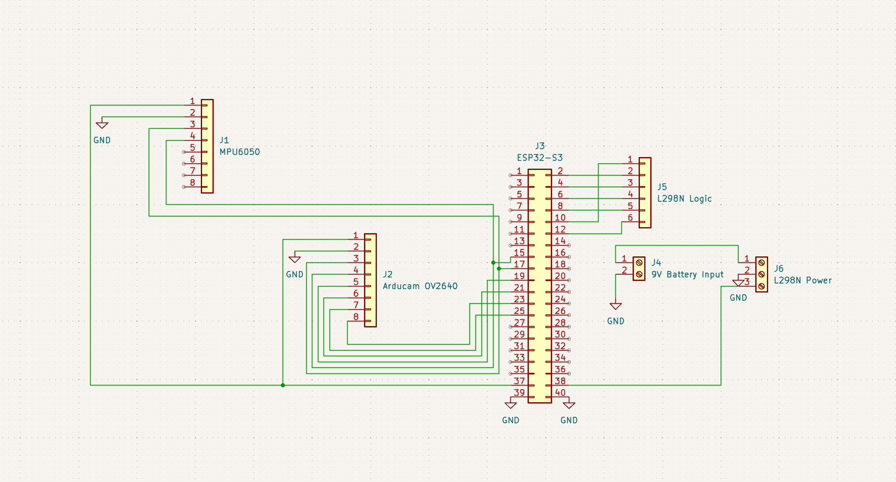

# Autonomous Navigation Rover

**🏆 1st Place | UCSD ECE Design Competition (Nov 2025 - Dec 2025)**

## Overview

This repository contains the firmware and hardware architecture for an autonomous navigation rover built on an ESP32. The system achieved the **fastest pathfinding** out of **13 competing teams** in the competition.

## Hardware Architecture

The rover uses a **custom 2-layer, 4x4 inch PCB** designed in **KiCad**, with power distribution optimized to reliably interface an **ESP32**, **OV2640 camera**, and **L298N motor driver**.

## Firmware Architecture

The firmware comprises **600+ lines of C++** authored for this project, including **custom I2C, SPI, and PWM libraries** to handle bare-metal sensor communication and motor control.

---

*UCSD ECE Design Competition — autonomous navigation & pathfinding.*
