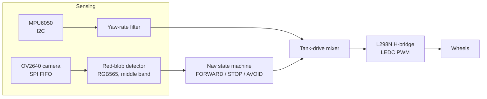
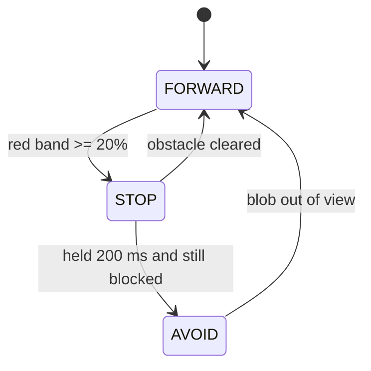
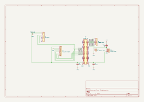

# Autonomous Navigation Rover

[](https://github.com/lxdinh/Autonomous-Rover/actions/workflows/build.yml)
[](https://www.espressif.com/en/products/socs/esp32-s3)
[](https://docs.platformio.org/en/latest/frameworks/arduino.html)
[](LICENSE)

**🏆 1st Place — UCSD ECE Design Competition (Nov–Dec 2025)** · fastest pathfinding of 13 teams

> Vision-guided autonomous ground rover on a custom ESP32-S3 PCB. An ArduCAM
> OV2640 camera runs on-board RGB565 obstacle detection, an MPU6050 IMU damps the
> heading, and an L298N H-bridge drives the wheels — coordinated by a lightweight
> **FORWARD → STOP → AVOID** state machine. Everything runs on the
> microcontroller.

## Highlights

- **Custom 2-layer, 4×4 in PCB** (KiCad) integrating the ESP32-S3, OV2640,
  MPU6050, and L298N with a shared logic/motor power tree — schematic and
  Gerbers in [`hardware/`](hardware/).
- **From-scratch bare-metal drivers**, no vendor HAL: custom I²C (MPU6050),
  SPI-FIFO (ArduCAM), and LEDC-PWM (L298N) classes — 600+ lines of C++.
- **On-board vision:** per-frame red-blob detection over the middle image band,
  feeding a deterministic navigation state machine.

## Architecture


```mermaid
flowchart LR
  subgraph Sensing
    CAM[OV2640 camera<br/>SPI FIFO] --> DET[Red-blob detector<br/>RGB565, middle band]
    IMU[MPU6050<br/>I2C] --> YAW[Yaw-rate filter]
  end
  DET --> SM[Nav state machine<br/>FORWARD / STOP / AVOID]
  YAW --> MIX[Tank-drive mixer]
  SM --> MIX
  MIX --> MOT[L298N H-bridge<br/>LEDC PWM] --> W[Wheels]
```

### Navigation state machine


```mermaid
stateDiagram-v2
  [*] --> FORWARD
  FORWARD --> STOP: red band >= 20%
  STOP --> AVOID: held 200 ms and still blocked
  STOP --> FORWARD: obstacle cleared
  AVOID --> FORWARD: blob out of view
```

## Repository layout

```text
Autonomous-Rover/
├── src/
│   ├── main.cpp            # nav state machine + obstacle detection + cruise mixer
│   ├── Camera_SPI.h        # ArduCAM OV2640 over SPI FIFO (DMA buffer, BMP/RGB565)
│   ├── Sensor_I2C.h        # MPU6050 IMU (accel/gyro), bare-metal I2C
│   └── MotorDriver_PWM.h   # L298N via ESP32 LEDC PWM (Arduino core 2.x/3.x aware)
├── include/memorysaver.h   # ArduCAM camera-model selector (OV2640 Mini 2MP)
├── hardware/               # KiCad project, schematic (SVG), Gerbers
├── platformio.ini
└── README.md
```

## Hardware

| Subsystem | Part | Interface |
| --- | --- | --- |
| MCU | ESP32-S3 (DevKitC-1 class) | — |
| Camera | ArduCAM OV2640 Mini 2MP | SPI FIFO + I²C control |
| IMU | MPU6050 (accel + gyro) | I²C @ `0x68` |
| Motor driver | L298N dual H-bridge | 6 GPIO (2 PWM enables + 4 direction) |
| Power | 9 V motor pack + 3.3 V logic | common ground |

### Pin map (ESP32-S3)

| Function | GPIO | | Function | GPIO |
| --- | --- | --- | --- | --- |
| L298N ENA — left PWM | 40 | | I²C SDA | 15 |
| L298N ENB — right PWM | 39 | | I²C SCL | 17 |
| L298N IN1 / IN2 — left dir | 44 / 43 | | SPI SCK | 12 |
| L298N IN3 / IN4 — right dir | 42 / 41 | | SPI MISO | 13 |
| Camera CS | 10 | | SPI MOSI | 11 |

### Schematic



## How obstacle detection works

Each captured frame is RGB565 (one 16-bit value per pixel). The detector scans
the **middle horizontal third** of the frame — where a head-on obstacle sits —
and flags a pixel as "red" when:

| Channel | Bits | Rule |
| --- | --- | --- |
| Red | 5 (0–31) | ≥ 22 |
| Green | 6 (0–63) | ≤ 14 |
| Blue | 5 (0–31) | ≤ 14 |

If **≥ 20 %** of the band's pixels pass, the frame is treated as blocked and the
state machine reacts. All thresholds are compile-time constants in
[`src/main.cpp`](src/main.cpp) — retune `RED_MIN_5BIT`, `GREEN_MAX_6BIT`,
`BLUE_MAX_5BIT`, and `DETECTION_THRESHOLD_PERCENT` for your obstacle color and
lighting.

## Build & flash

Built with **[PlatformIO](https://platformio.org/)** (ESP32-S3 / Arduino
framework). The ArduCAM library is pulled from the PlatformIO registry
automatically; the camera model is selected via the `-DOV2640_MINI_2MP` build
flag in [`platformio.ini`](platformio.ini).

```bash
# from the repo root
pio run                        # compile
pio run -t upload              # flash (board on its native USB port)
pio device monitor -b 115200   # serial @ 115200
```

**Arduino IDE** users: install the **ArduCAM** library, provide a `memorysaver.h`
with `#define OV2640_MINI_2MP`, select an ESP32-S3 board with **USB CDC On Boot:
Enabled**, and build `src/main.cpp`.

## Design notes & tuning

- **Motor duty is capped** to `MOTOR_MAX_DUTY_PCT` (85 %) so that simultaneous
  acceleration on a sagging 9 V pack does not brown out the 3.3 V logic rail.
- **Camera resolution is read from the BMP header** on every capture, so the
  pipeline is robust to QVGA/QCIF differences across ArduCAM firmware revisions.
- **Heading hold:** the MPU6050 yaw-rate currently applies gentle equal-wheel
  damping. Promoting it to a *differential* correction (opposite sign per wheel)
  is the natural next step for tighter straight-line tracking; the mixer already
  exposes a symmetric correction term to build on.

## License

MIT — see [LICENSE](LICENSE). Firmware and hardware authored for the UCSD ECE
Design Competition.
